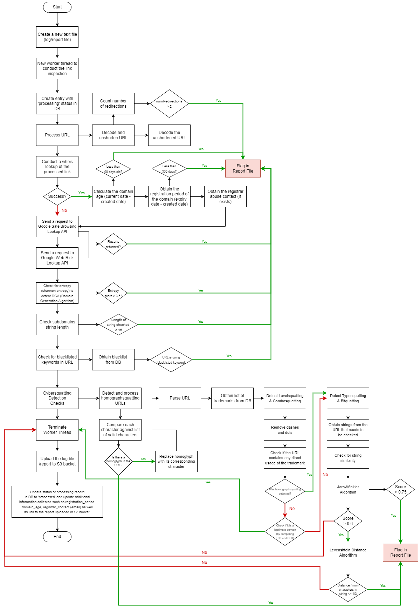
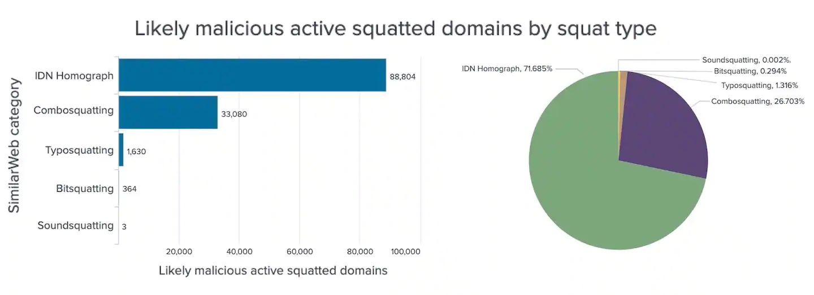
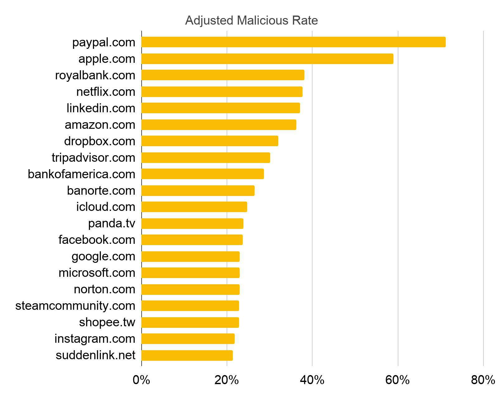

#  Mechanisms to inspect the URL submitted

### What does URL inspection do?

After the user submits the URL via the API, it will go through a series of checks and identify any anomalies and flag them in a report file.
This file will then be uploaded to a bucket on S3.

### Flow Chart

This is our current implementation (subjected to changes).

### How does it work?

1. Firstly, it creates a new worker thread to start the processing and creates an entry in the mongoDB (`inspected_links`) with a status of `processing`.
   
2. Processes the URL
   1. Decode and unshorten
      1. We consider that the URL may have been encoded to hide any content that may seem suspicious to the victim at the first sight. Hence, we decode the link.
      2. Unshortening the link as the link may be using a URL shortening service like bit.ly or s.id, multiple times to make the link look less suspicious.
      3. Count number of times the page redirects. If it redirects > `2` times, we consider it suspicious and an anomaly and flag it in the report file.
   2. Decode the unshortened URL
      1. As the link could have been encoded before shortening, we will decode it another time for the later checks.

3. Conduct a whois lookup of the processed link
   1. This check may or may not return a result as the domain could have already been taken down.
   2. After getting the results:
      1. Calculate domain age (current date - created date)
         1. Flag if the domain age (in days) is less than the defined threshold.
      2. Obtain the registration period of the domain (expiry date - created date)
         1. Flag if the registration period is < `366` days (366 with considerations for leap years).
         2. In our research, it was noted that most legitimate domains will register their domains several years in advance, or for several years, while phishing domains usually only register for a year.
      3. Obtain the registrar abuse contact (if exists)
         1. This contact is stored in the DB and is used in the DNS takedown feature.

4. Google's Safe Browsing Lookup API
   1. As an additional check, we also send requests to [Google's Safe Browsing Lookup API](https://developers.google.com/safe-browsing/v4/lookup-api).
   
       > The Safe Browsing APIs (v4) let your client applications check URLs against Google's constantly updated lists of unsafe web resources. Examples of unsafe web resources are social engineering sites (phishing and deceptive sites) and sites that host malware or unwanted software. Any URL found on a Safe Browsing list is considered unsafe.

        The purpose of having this check is because the URL may have already been flagged by Google previously.
    2. Flag if results were returned.

5. Google's Web Risk Lookup API
   1. Similar to the previous check, but this time to [Google's Web Risk Lookup API](https://cloud.google.com/web-risk/docs/lookup-api).
   2. Flag if results were returned.

6. Check for entropy
   1. Read more about it [here](https://www.splunk.com/en_us/blog/security/random-words-on-entropy-and-dns.html?301=/blog/2015/10/01/random-words-on-entropy-and-dns.html).
   2. Flag if the entropy score is more than the defined threshold.

7. Check for the string length of subdomains
   1. Phishing sites sometimes have unusually long subdomains, which sometimes also trigger the entropy check as they are long random characters. But sometimes, these long subdomains could be strings that make sense as well. 
   
      For e.g.:
      1. https[:]//www[.]paypai.com-service.confirm.cgi-bin.w2bscr-cmd.login.submit.new-load.`5885d80a13c0db1f8e263663d3faee8dcbcd55a50598f`[.]agled[.]com[.]ar/paypai-login/service/dir.php
      2. https[:]//paypa[.]l.com.cgi.bin.webscr.cmd.login.submit.dispatch.`5885d80a13c0db1f8211h516223669321141112445`.autosurfxxx[.]wrenchhost[.]com/
      3. https[:]//secure[.]`pay-pal-comfort`.de/index.php
   2. Flag if the length exceeds a certain defined threshold.
   
8. Check for blacklisted keywords in URL
   1. It has been noted that phishing sites often used a series of keywords, as part of cybersquatting (the next section). As an additional check, we also check for usage of such keywords within the URL, for example:
      1. `security`
      2. `bet`
      3. `installment`
      4. `online`
      5. `credential`
      6. `alert`
      7. `bank`
      8. `bill`
      9. `update`
      10. and many more...
   2. Flag if blacklisted keyword was found in the URL.
   3. As this check is heavily dependent on our list of blacklisted keywords, we will work to find out more of these keywords to popular this list.

9.  Cybersquatting Checks
   > Cybersquatting is the practice of registering, trafficking in, or using an Internet domain name, with a bad faith intent to profit from the goodwill of a trademark belonging to someone else.

   There are different types of cybersquatting, find out more at:
   * [Cybersquatting: Attackers Mimicking Domains of Major Brands Including Facebook, Apple, Amazon and Netflix to Scam Consumers](https://unit42.paloaltonetworks.com/cybersquatting/)
   * [Akamai Blog | DNS Cybersquatting: The Case for Edge DNS Zone Protect](https://www.akamai.com/blog/security/dns-cybersquatting)

    We implemeneted checks for the few most common types of Cybersquatting:
    - Homographsquatting
    - Levelsquatting
    - Combosquatting
    - Bitsquatting
    - Typosquatting
    > 

   1. DB
   
        These are some commonly abused domains by phishing sites. In our DB, we keep a list of such commonly abused sites, and their "trademarks". For example, the trademark of PayPal would be `paypal`.
        > 

      > **Note**
      > As the cybersquatting checks are heavily dependent on our list of commonly abused domains by phishing sites, we will work to populate the DB with more of these websites.
    
   2. Homographsquatting
        > Homographsquatting domains take advantage of internationalized domain names (IDNs), where Unicode characters are allowed (such as microsofŧ[.]com). Attackers usually replace one or more characters in the target domain with visually similar characters from another language. These domains can be perfectly indistinguishable from their targets, as in the case of apple.com, where the English letter "a" (U+0061) was replaced with the Cyrillic letter "а" (U+0430). 

        1. For this check, we store a dictionary of alphanumeric characters and their homoglyphs. A list of "valid" characters is also stored. 
        2. We check the URL for any presence of homoglyphs based on the list of valid characters.
           1. Flag if homoglyphs found.
           2. We also replace the homoglyphs with their corresponding characters before continuing on with the checks to increase the accuracy of later checks.

   3. Levelsquatting & Combosquatting
        > Combosquatting is another widespread registration abuse that combines popular trademarks with words such as “security,” “payment” or “verification.” Combosquatting domains like netflix-payments[.]com are often used in phishing emails, by scam websites and for social engineering attacks to convince users that they are visiting web content maintained by the targeted trademark. 

        > Levelsquatting domains, such as the case of safety.microsoft.com.mdmfmztwjj.l6kan7uf04p102xmpq[.]bid, include the targeted brand’s domain name as a subdomain. In this example, the victims of the phishing attack might believe they are visiting safety.microsoft.com, when instead, they are visiting the attacker’s website. This attack is especially worrisome for mobile users because the browser's address bar might not be wide enough to display the entire domain name. 

        1. For this check, we look for direct usage of the trademarks of commonly-abused domains after processing the url to remove any `-` or `.`. In this case, removing `.` is because it could be a levelsquat, and `-` because it could be a combosquat.
           1. With consideration that a legitimate URL may have been submitted, we also compare the SLD and TLD or the URL with the legitimate site as the combination of SLD and TLD are unique to the company/organization.
           2. Flag if any direct usage of a trademark was found and if it was not a legitimate domain.

    4. Typosquatting & Bitsquatting
       1. As both types of squatting are very similar, they were combined into a single check.
       2. We check for string similarity between strings in the URL against the trademarks of commonly-abused domains.
          1. Jaro-Winkler Algorithm
          2. Levenshtein Distance Algorithm
          3. Flag if it exceeds a threshold defined.
 
 10. Once all checks are completed, we terminate the worker thread and upload the report to an S3 bucket which will be used in our frontend application and also used by our content-inspection feature.
    1. Also updates the record in the DB, status from `processing` to `processed`.
    2. Also updates any additional information collected during the checks, such as the URL to the report in the S3 bucket, the domain_age, the registrar_content, etc.